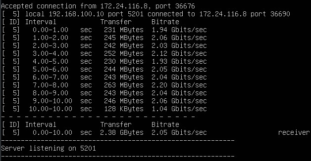
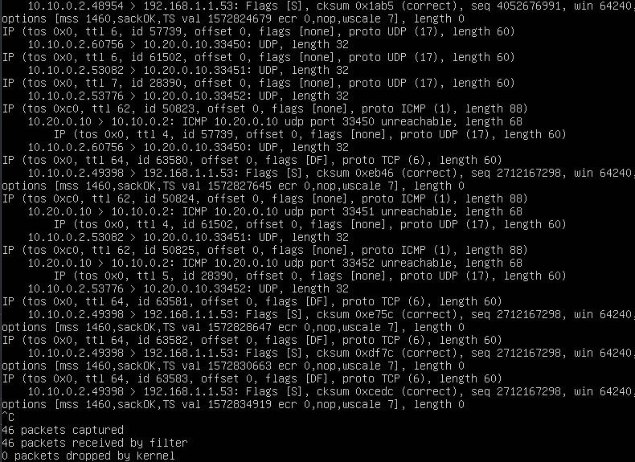
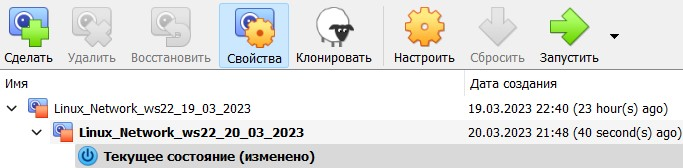
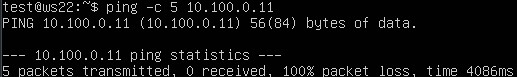

## Part 1. Инструмент *ipcalc* <br/>

### 1.1 Сети и маски <br/>

* Установим `ipcalc`.<br/>
  <br/>
* Определим адрес сети `192.167.38.54/13`.<br/>
  <br/>
  * адрес сети - `192.160.0.0`.<br/>
* Перевод маски `255.255.255.0` в префиксную и двоичную запись.<br/>
  <br/>
  * префиксная запись - `/24`.<br/>
  * двоичная запись - `11111111.11111111.11111111.00000000`.<br/>
* Перевод маски `/15` в обычную и двоичную запись.<br/>
  <br/>
  * обычная запись - `255.254.0.0`.<br/>
  * двоичная запись - `11111111.11111110.00000000.00000000`.<br/>
* Перевод маски `11111111.11111111.11111111.11110000` в обычную и префиксную запись.<br/>
  <br/>
  * обычная запись - `255.255.255.240`.<br/>
  * префиксная запись - `/28`.<br/>
* Минимальный и максимальный хост для сети `12.167.38.4`:
  * при маске `/8`.<br/>
    <br/>
    * минимальный хост - `12.0.0.1`.<br/>
    * максимальный хост - `12.255.255.254`.<br/>
  * при маске `11111111.11111111.00000000.00000000` в префиксной форме `/16`.<br/>
    <br/>
    * минимальный хост - `12.167.0.1`.<br/>
    * максимальный хост - `12.167.255.254`.<br/>
  * при маске `255.255.254.0`.<br/>
    <br/>
    * минимальный хост - `12.167.38.1`.<br/>
    * максимальный хост - `12.167.39.254`.<br/>
  * при маске `/4`.<br/>
    <br/>
    * минимальный хост - `0.0.0.1`.<br/>
    * максимальный хост - `15.255.255.254`.<br/>

### 1.2 *localhost* <br/>

* Определим минимальный и максимальный хост для сети `127.0.0.0/8`.<br/>
  <br/>
* Все IP-адреса, находящиеся в промежутке от `127.0.0.1` до `127.255.255.254` могут обратиться к приложению, работающему на `localhost`, следовательно: <br/>
  *  `194.34.23.100` - не может обратиться.<br/>
  *  `127.0.0.2` - может обратиться.<br/>
  *  `127.1.0.1` - может обратиться.<br/>
  *  `128.0.0.1` - не может обратиться.<br/>

### 1.3. Диапазоны и сегменты сетей <br/>

> Диапазоны IP-адресов, специально выделенных для частных сетей:
> - класс А - 10.0.0.0–10.255.255.255
> - класс B - 172.16.0.0–172.31.255.255
> - класс С -  192.168.0.0–192.168.255.255

* Следовательно, следующие IP можно использовать в качестве `частных`:
  * 10.0.0.45.<br/>
  * 192.168.4.2.<br/>
  * 172.20.250.4.<br/>
  * 172.16.255.255.<br/>
  * 10.10.10.10.<br/>
* Следующие IP можно использовать в качестве `публичных`:
  * 134.43.0.2.<br/>
  * 172.0.2.1.<br/>
  * 192.172.0.1.<br/>
  * 172.68.0.2.<br/>
  * 192.169.168.1.<br/>
* Определим минимальный и максимальный хост для сети `10.10.0.0/18`.<br/>
  <br/>
  * Следовательно, следующие перечисленные IP адреса шлюза `возможны` у сети:<br/>
    * 10.10.0.2.<br/>
    * 10.10.10.10.<br/>
    * 10.10.1.255.<br/>
  * Следующие перечисленные IP адреса шлюза `не возможны` у сети:<br/>
    * 10.0.0.1.<br/>
    * 10.10.100.1.<br/>

## Part 2. Статическая маршрутизация между двумя машинами <br/>

* Перед запуском виртуальных машин, настроим сетевые адаптеры для каждой из них в среде `VirtualBox`:<br/>
  <br/>
    * Выбираем тип подключения `Внутренняя сеть`.<br/>
    * Вводим имя сети `local`.<br/>
* Запускаем виртульные машины.<br/>
* Посмотрим существующие сетевые интерфейсы для машины `ws1`.<br/>
  <br/>
* Посмотрим существующие сетевые интерфейсы для машины `ws2`.<br/>
  <br/>
* Опишем сетевой интерфейс, соответствующий внутренней сети, машине `ws1`, изменяя файл с помощью команды `sudo vim /etc/netplan/00-installer-config.yaml`.<br/>
  <br/>
* Опишем сетевой интерфейс, соответствующий внутренней сети, машине `ws2`, изменяя файл с помощью команды `sudo vim /etc/netplan/00-installer-config.yaml`.<br/>
  <br/>
* Выполним команду `netplan apply` для перезапуска сервиса сети.<br/>
  <br/>
  <br/>

### 2.1. Добавление статического маршрута вручную <br/>

* Добавляем статический маршрут от `ws1` к `ws2`.<br/>
  <br/>
* Добавляем статический маршрут от `ws2` к `ws1`.<br/>
  <br/>
* Пропинговываем соединения.<br/>
  <br/>
  <br/>

### 2.2. Добавление статического маршрута с сохранением <br/>

* Перезапустим виртуальные машины.<br/>
* Опишем сетевой интерфейс, соответствующий внутренней сети, машине `ws1`, изменяя файл с помощью команды `sudo vim /etc/netplan/00-installer-config.yaml`.<br/>
  <br/>
* Опишем сетевой интерфейс, соответствующий внутренней сети, машине `ws2`, изменяя файл с помощью команды `sudo vim /etc/netplan/00-installer-config.yaml`.<br/>
  <br/>
* Выполним команду `netplan apply` для перезапуска сервиса сети.<br/>
  <br/>
  <br/>
* Пропинговываем соединения.<br/>
  <br/>
  <br/>

## Part 3. Утилита *iperf3* <br/>

### 3.1. Скорость соединения <br/>

* Переведем следующие скорости соединения:<br/>
  * `8 Mbps` = 1 MB/s.<br/>
  * `100 MB/s` = 800000 Kbps.<br/>
  * `1 Gbps` = 1000 Mbps.<br/>

### 3.2. Утилита *iperf3*

* Установим утилиту `iperf3`.<br>
  <br/>
* Измерим скорость соединения между `ws1` и `ws2`.<br/>
* Для этого на машине `ws1`, которой будет выступать в роли сервера, выполним команду:<br/>
  <br/>
* На машине `ws2`, которой будет выступать в роли клиента, выполним команду:<br/>
  <br/>
* Результат выполнения на `ws1`.<br/>
  <br/>
* Результат выполнения на `ws2`.<br/>
  <br/>

## Part 4. Сетевой экран <br/>

### 4.1. Утилита *iptables*

* Установим утилиту `iptables`.<br/>
  <br/>
* Создадим файл `/etc/firewall.sh`, имитирующий фаерволл, на `ws1` и `ws2`.<br/>
  <br/>
* Добавим подряд в файл следующие правила: <br/>
  1. на `ws1` применяем стратегию, когда в начале пишется запрещающее правило, а в конце пишется разрешающее правило (это касается пунктов 4 и 5).<br/>
  2. на `ws2` применяем стратегию, когда в начале пишется разрешающее правило, а в конце пишется запрещающее правило (это касается пунктов 4 и 5).<br/>
  3. открываем на машинах доступ для `порта 22` (ssh) и `порта 80` (http).<br/>
  4. `запрещаем echo reply` (машина не должна "пинговаться”, т.е. должна быть блокировка на OUTPUT).<br/>
  5. `разрешаем echo reply` (машина должна "пинговаться").<br/>
* Итоговый вид файла для `ws1`.<br/>
  <br/>
* Итоговый вид файла для `ws2`.<br/>
  <br/>
* Даем права доступа на выполнение скрипта.<br/>
  <br/>
  <br/>
* Запускаем скрипты.<br/>
  * Результат выполнения скрипта на `ws1`.<br/>
    <br/>
  * Результат выполнения скрипта на `ws2`.<br/>
    <br/>
* Отобразим список правил на `ws1`.<br/>
  <br/>
* Отобразим список правил на `ws2`.<br/>
  <br/>
* Сравним цепочки правил. Заметим, что на `ws1` сначала идет запрещающее правило, а затем разрешающее. На `ws2`, наоборот.

### 4.2. Утилита *nmap*

* Установим утилиту `nmap`.<br/>
  <br/>
* Пропингуем `ws1` -> `ws2`.<br/>
  <br/>
  * `ws2` пингуется.<br/>
* Пропингуем `ws2` -> `ws1`.<br/>
  <br/>
  * `ws1` не пингуется.<br/>
* С помощью утилиты `nmap` покажем, что хост машины `ws1` запущен.<br/>
  <br/>
* Сохраним дампы образов виртуальных машин с помощью средств `VirtualBox`.<br/>
  <br/>
  <br/>

## Part 5. Статическая маршрутизация сети <br/>

* Перед запуском виртуальных машин выполним подключение адаптеров в `VirtualBox`.<br/>
* Настраиваемая сеть:
  <br/>

### 5.1. Настройка адресов машин <br/>

* Настроим конфигурации машин в `/etc/netplan/00-installer-config.yaml` согласно сети на рисунке.<br/>
  * `ws11` и `ws21`.<br/>
  <br/>
  * `ws22` и `r1`.<br/>
  <br/>
  * `r2`.<br/>
  <br/>
* Перезапустим сервис сети и проверим, что адреса машин заданы верно.<br/>
  * `ws11`.<br/>
    <br/>
  * `ws21`.<br/>
    <br/>
  * `ws22`.<br/>
    <br/>
  * `r1`.<br/>
    <br/>
  * `r2`.<br/>
    <br/>
* Пропингуем `ws22` с `ws21`.<br/>
  <br/>
* Пропингуем `r1` с `ws11`.<br/>
  <br/>

### 5.2. Включение переадресации IP-адресов <br/>

* Для включения переадресации IP, выполним следующую команду на роутерах `r1` и  `r2`.<br/>
  <br/>
  <br/>

> При таком подходе переадресация `не будет` работать после перезагрузки системы!

* Для реализации другого подхода, на роутерах `r1` и  `r2`, откроем файл `/etc/sysctl.conf` и раскомментируем следующую строку:<br>
  ``` 
  net.ipv4.ip_forward = 1 
  ```
  * Исправленный файл.<br/>
    <br/>

  > При использовании этого подхода, IP-переадресация включена на `постоянной основе`!

### 5.3. Установка маршрута по-умолчанию <br/>

* Вывод команды `ip r` до добавления шлюза.<br/>
  * `ws11`.<br/>
    <br/>
  * `ws21`.<br/>
    <br/>
  * `ws22`.<br/>
    <br/>
* Настроим маршрут по-умолчанию (шлюз) для рабочих станций `ws11`, `ws21` и `ws22`. Для этого добавим `default` перед IP роутера в файле конфигураций `/etc/netplan/00-installer-config.yaml`.<br/>
  * `ws11`.<br/>
    <br/>
  * `ws21`.<br/>
    <br/>
  * `ws22`.<br/>
    <br/>
* Вызовем `ip r` и покажем, что добавился маршрут в таблицу маршрутизации.<br/>
  * `ws11`.<br/>
    <br/>
  * `ws21`.<br/>
    <br/>
  * `ws22`.<br/>
    <br/>
* Пропингуем с `ws11` роутер `r2` и покажем на `r2`, что пинг доходит. Для этого на `r2` используем команду<br/>
  ```
  $ sudo tcpdump -tn -i enp0s8
  ```
  <br/>
  <br/>

### 5.4. Добавление статических маршрутов <br/>

* Добавим в роутеры `r1` и `r2` статические маршруты в файле конфигураций `/etc/netplan/00-installer-config.yaml`.<br/>
  * `r1`.<br/>
    <br/>
  * `r2`.<br/>
    <br/>
* Вызовем `ip r` и покажем таблицы с маршрутами на обоих роутерах.
  * `r1`.<br/>
    <br/>
  * `r2`.<br/>
    <br/>
* Запустим команды на `ws11`:
  ```
  $ ip r list 10.10.0.0/18
  ```
    <br/>
  ```
  $ ip r list 0.0.0.0/0
  ```
    <br/>
* Заметим, что выводы отличаются. Причина в том, что в случае с маршрутом до `10.10.0.0/18,` машине не требуется обращаться к роутеру, так как она уже находится в этой сети.<br/>
  
  > IP-адрес `0.0.0.0/0` — это немаршрутизируемый адрес IPv4, который можно использовать в разных целях, в основном, в качестве адреса по умолчанию или адреса-заполнителя.<br/>
  > Случаи применения:<br/>
  > * `В качестве статического маршрута по умолчанию`. Это означает, что в таблице маршрутизации не указан конкретный адрес в качестве следующего перехода на пути пакета к его конечному получателю. Когда маршрут по умолчанию используется с маской подсети 0.0.0.0, он соответствует любому адресу. При использовании с маской 255.255.255.255 она не соответствует ни одному маршруту.<br/>
  > * `В локальной сети`. В локальной сети адрес 0.0.0.0 можно использовать в качестве адреса источника в широковещательной передаче IPv4, которая используется для передачи данных на все устройства в локальной сети.<br/>
  > * `На серверах`. IP-адрес 0.0.0.0 может использоваться на серверах для обозначения того, что служба может связываться со всеми сетевыми интерфейсами. Он дает команду серверу «прослушивать» и принимать соединения с любого IP-адреса.<br/>
  > * `На ПК и клиентских устройствах`. Адрес 0.0.0.0 указывает, что клиент не подключен к сети TCP / IP, и устройство может дать себе адрес 0.0.0.0, когда оно находится в автономном режиме.<br/>

### 5.5. Построение списка маршрутизаторов <br/>

* Установим утилиту `traceroute`.<br/>
  <br/>
* Запустим на `r1` команду дампа.<br/>
  <br/>
* При помощи утилиты `traceroute` построим список маршрутизаторов на пути от `ws11` до `ws21`.<br/>
  <br/>
* Результат дампа на `r1`.<br/>
  <br/>

> **Принцип работы `traceroute`**:<br/>
> Для определения промежуточных маршрутизаторов `traceroute` отправляет целевому узлу серию `ICMP-пакетов` (по умолчанию 3 пакета), с каждым шагом увеличивая значение поля `TTL` («время жизни») на 1. Это поле обычно указывает максимальное количество маршрутизаторов, которое может быть пройдено пакетом.<br/>
> Первая серия пакетов отправляется с `TTL`, равным 1, и поэтому первый же маршрутизатор возвращает обратно `ICMP-сообщение` «time exceeded in transit», указывающее на невозможность доставки данных. `Traceroute` фиксирует адрес маршрутизатора, а также время между отправкой пакета и получением ответа (эти сведения выводятся на монитор компьютера).<br/>
> Затем `traceroute` повторяет отправку серии пакетов, но уже с `TTL`, равным 2, что заставляет первый маршрутизатор уменьшить `TTL` пакетов на единицу и направить их ко второму маршрутизатору. Второй маршрутизатор, получив пакеты с `TTL`=1, так же возвращает `«time exceeded in transit»`.<br/> Процесс повторяется до тех пор, пока пакет не достигнет целевого узла. При получении ответа от этого узла `процесс трассировки считается завершённым`.<br/>
> На оконечном хосте `IP-датаграмма` с `TTL` = 1 не отбрасывается и не вызывает `ICMP-сообщения` типа срок истёк, а должна быть отдана приложению.<br/>
> Достижение пункта назначения определяется следующим образом:<br>
> Отсылаемые `traceroute` датаграммы содержат UDP-пакет с заведомо неиспользуемым номером порта на адресуемом хосте. Номер порта будет равен 33434 + (максимальное количество транзитных участков до узла) — 1. В пункте назначения UDP-модуль, получая подобные датаграммы, возвращает `ICMP-сообщения` об ошибке «порт недоступен». Таким образом, чтобы узнать о завершении работы, программе `traceroute` достаточно обнаружить, что поступило `ICMP-сообщение` об ошибке этого типа.

### 5.6. Использование протокола `ICMP` при маршрутизации <br/>

* Запустим на `r1` перехват сетевого трафика, проходящего через `enp0s8`.<br/>
  <br/>
* Пропингуем с `ws11` несуществующий `IP 10.30.0.111`.<br/>
  <br/>
* Результат дампа на `r1`.<br/>
  <br/>
* Сохраним дампы образов виртуальных машин с помощью средств `VirtualBox`.<br/>
  <br/>
  <br/>
  <br/>
  <br/>
  <br/>

## Part 6. Динамическая настройка *IP* с помощью *DHCP* <br/>

* Для `r2` настроим в файле `/etc/dhcp/dhcpd.conf` конфигурацию службы `DHCP`:<br/>
  * Укажем адрес маршрутизатора по-умолчанию, DNS-сервер и адрес внутренней сети.<br/>
    <br/>
  * В файле `/etc/resolv.conf` пропишем `nameserver 8.8.8.8`.<br/>
    <br/>
* Установим службу `isc-dhcp-server`.<br/>
  <br/>
* Перезагрузим службу `DHCP`.<br/>
  <br/>
* На `ws21` изменим файл конфигурации `/etc/netplan/00-installer-config.yaml`.<br/>
  <br/>
* Перезагрузим машину `ws21`.<br/>
  <br/>
* С помощью `ip a` покажем, что `ws21` получила адрес.<br/>
  <br/>
* Пропингуем `ws21` -> `ws22`.<br/>
  <br/>
* Укажем MAC адрес у `ws11` в файле конфигурации `/etc/netplan/00-installer-config.yaml`.<br/>
  <br/>
* Для `r1` настроим в файле `/etc/dhcp/dhcpd.conf` конфигурацию службы `DHCP`:<br/>
  * Укажем адрес маршрутизатора по-умолчанию, DNS-сервер и адрес внутренней сети.<br/>
    <br/>
  * В файле `/etc/resolv.conf` пропишем `nameserver 8.8.8.8`.<br/>
    <br/>
* Перезагрузим службу `DHCP`.<br/>
  <br/>
* Выключим машину `ws11` и изменим MAC адрес адаптера в `VirtualBox` и запустим вновь.<br/>
  <br/>
* С помощью `ip a` покажем, что `ws11` получила адрес.<br/>
  <br/>
* Пропингуем `ws11` -> `ws22`.<br/>
  <br/>
* IP `ws21` до обновления.<br/>
  <br/>
* Отключим назначенный адрес `ws21`.<br/>
  <br/>
* Запросим обновление ip адреса `ws21`.<br/>
  <br/>
* Проверим обновление ip адреса `ws21`.<br/>
  <br/>
* Сохраним дампы образов виртуальных машин с помощью средств `VirtualBox`.<br/>
  <br/>
  <br/>
  <br/>
  <br/>
  <br/>

## Part 7. *NAT* <br/>

* Установим на `r1` и `ws22` веб-сервер `apache2`.<br/>
  <br/>
* В файле `/etc/apache2/ports.conf` на `ws22` и `r1` изменим строку `Listen 80` на `Listen 0.0.0.0:80`, то есть сделаем сервер `Apache2` общедоступным.<br/>
  <br/>
* Запустим веб-сервер `Apache` на `ws22` и `r1`.<br/>
  <br/>
  <br/>
* Добавим в фаервол на `r2` следующие правила:<br/>
  1. удаление правил в таблице filter - `iptables -F`<br/>
  2. удаление правил в таблице "NAT" - `iptables -F -t nat`<br/>
  3. отбрасывать все маршрутизируемые пакеты - `iptables --policy FORWARD DROP`<br/>
* Итоговый вид файла `/etc/firewall.sh`.<br/>
  <br/>
* Даем права доступа на выполнение скрипта.<br/>
  <br/>
* Запускаем скрипт.<br/>
  <br/>
* Проверим соединение между `ws22` и `r1`.<br/>
  <br/>
  * Заметим, что машины `не пингуются`.<br/>
* Добавим в файл `/etc/firewall.sh` ещё одно правило:<br/>
  4. разрешить маршрутизацию всех пакетов протокола ICMP.<br/>
* Итоговый вид файла `/etc/firewall.sh`.<br/>
  <br/>
* Запускаем скрипт.<br/>
  <br/>
* Проверим соединение между `ws22` и `r1`.<br/>
  <br/>
  * Заметим, что машины `пингуются`.<br/>
* Добавим в файл `/etc/firewall.sh` ещё два правила:<br/>
  5. включить `SNAT`, а именно маскирование всех локальных ip из локальной сети, находящейся за `r2` (сеть 10.20.0.0).<br/>
  6. включить `DNAT` на 8080 порт машины `r2` и добавить к веб-серверу Apache, запущенному на `ws22`, доступ извне сети.<br/>
  7. разрешим маршрутизацию внутренних пакетов.<br/>
  8. снизим нагрузку на систему, пропуская внешние пакеты с уже установленным соединением.<br/>
  > Правила 7 и 8 необходимо поместить `выше`, чем правила 5 и 6.<br/>
* Итоговый вид файла `/etc/firewall.sh`.<br/>
  <br/>
* Запускаем скрипт.<br/>
  <br/>
* Проверим соединение по TCP для `SNAT`, для этого с `ws22` подключимся к серверу Apache на `r1`.<br/>
  <br/>
* Проверим соединение по TCP для `DNAT`, для этого с `r1` подключимся к серверу Apache на `ws22` (обращаемся по адресу `r2` и порту `8080`).<br/>
  <br/>
* Сохраним дампы образов виртуальных машин с помощью средств `VirtualBox`.<br/>
  <br/>
  <br/>
  <br/>
  <br/>
  <br/>

### Дополнительная информация по *SNAT* и *DNAT* <br/>
> <br/>
> 
> `SNAT (Source Network Address Translation)` - изменение адреса и порта источника пакета, доступен в цепочке `POSTROUTING`.<br/>
> <br/>
> `SNAT` заменяет адрес источника пакета внешним адресом, также, при необходимости, меняет и порт источника, что позволяет различать запросы, сделанные с одного и того же порта разных ПК, запись о выполненной трансляции заносится в специальную таблицу трансляций (она же таблица NAT). Получив ответ роутер находит запись в таблице трансляций и на ее основании изменяет адрес и порт назначения ответного пакета, после чего он прозрачно доставляется адресату в локальной сети.<br/>
>
> <br/>
> `DNAT (Destination Network Address Translation)` - изменение адреса и порта назначения пакета, доступен в цепочках `PREROUTING` и `OUTPUT`.<br/> Используется для перенаправления входящих пакетов с внешнего адреса/порта на приватный IP-адрес/порт внутри частной сети.<br/>

## Part 8. Дополнительно. Знакомство с `SSH Tunnels` <br/>

* Запустим на `r2` фаервол с правилами из Части 7.<br/>
  <br/>
* Запустим веб-сервер `Apache` на `ws22` только на `localhost` (то есть в файле `/etc/apache2/ports.conf` изменим строку `Listen 80` на `Listen localhost:80`).<br/>
  <br/>
* Перезапустим веб-сервер `Apache` на `ws22`.<br/>
  <br/>
* Проверим статус сервиса `SSHd`.<br/>
  <br/>
* Воспользуемся `Local TCP forwarding` с `ws21` до `ws22`, чтобы получить доступ к веб-серверу на `ws22` с `ws21`.<br/>
  <br/>
* Проверим, сработало ли подключение, для этого перейдем во второй терминал (Alt + F2).<br/>
  <br/>

  > `Local TCP forwarding` — проброс локального порта на удаленный сервер.<br>
  > В этом режиме мы создаем на своем компьютере `локальный` TCP порт, подключения к которому перенаправляются через SSH туннель на указанный порт удаленного сервера.<br/>
  > <br/>

* Воспользуемся `Remote TCP forwarding` c `ws22` до `ws11`, чтобы получить доступ к веб-серверу на `ws22` с `ws11`.<br>
  <br/>
* Проверим, сработало ли подключение, для этого перейдем во терминал `ws11`.<br/>
  <br/>

  > `Remote TCP forwarding` — проброс удаленного порта на локальный компьютер.<br/>
  > Переброс порта с удалённой машины используется в тех случаях, если нужно предоставить доступ на свой хост. <br/>
  > <br/>

* Сохраним дампы образов виртуальных машин с помощью средств `VirtualBox`.<br/>
  <br/>
  <br/>
  <br/>
  <br/>
  <br/>
